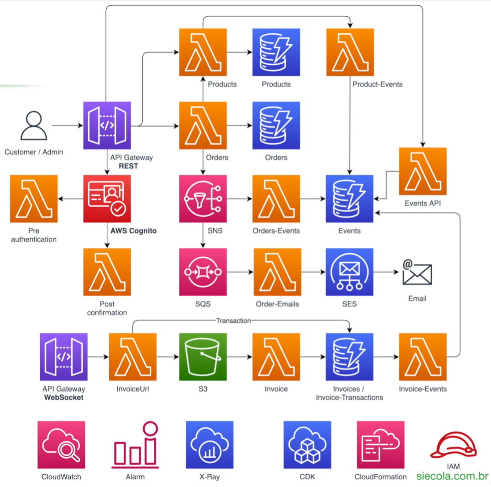

# Ecommerce AWS with CDK

This serverless e-commerce project leverages modern AWS services and tools to build a scalable, event-driven backend using infrastructure as code.

## 🧠 Technologies
Node.js and TypeScript for application development.

AWS CDK (Cloud Development Kit) in TypeScript for infrastructure as code.

## ☁️ AWS Services
AWS Lambda: Serverless compute to handle business logic with synchronous and asynchronous invocation.

Amazon DynamoDB: NoSQL database with composite keys, provisioned/on-demand modes, auto scaling, and streams.

Amazon API Gateway: Creation of REST and WebSocket APIs with request validation and bidirectional communication.

Amazon S3: File import and processing through event-driven functions.

Amazon SNS: Pub/Sub messaging with filters, integrated with Lambda and SQS.

Amazon SQS: Asynchronous message queue with Dead Letter Queue (DLQ) support and SNS subscription.

Amazon SES: Email sending through Lambda functions.

Amazon EventBridge: Event bus for audit logging and rule-based routing.

AWS CloudWatch: Centralized logging, metrics, dashboards, alarms, and log insights.

AWS IAM: Fine-grained access control, including item-level permissions in DynamoDB.

AWS Cost Explorer: Cost monitoring and tagging for usage tracking.

## ⚙️ Architecture Features
Synchronous and asynchronous Lambda execution.

Use of Lambda Layers for shared dependencies.

Real-time client-server communication using WebSockets.

Fault-tolerant design with DLQs and retries.

Resource management via CloudFormation stacks using CDK.

Cost control and governance using tagging.

This is a blank project for CDK development with TypeScript.

The `cdk.json` file tells the CDK Toolkit how to execute your app.

## Useful commands

* `npm run build`   compile typescript to js
* `npm run watch`   watch for changes and compile
* `npm run test`    perform the jest unit tests
* `npx cdk deploy`  deploy this stack to your default AWS account/region
* `npx cdk diff`    compare deployed stack with current state
* `npx cdk synth`   emits the synthesized CloudFormation template
